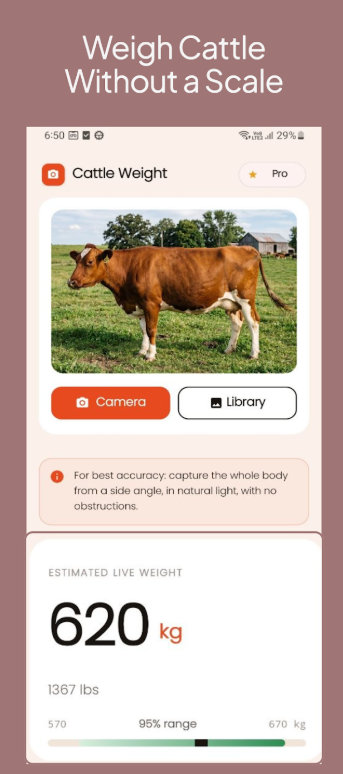
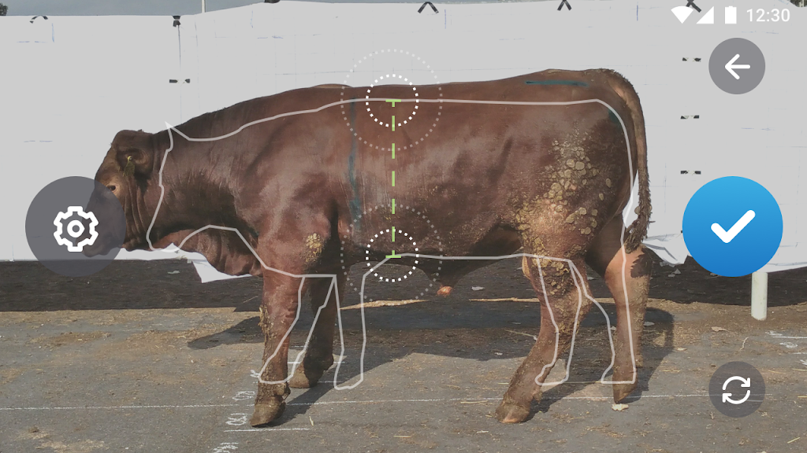
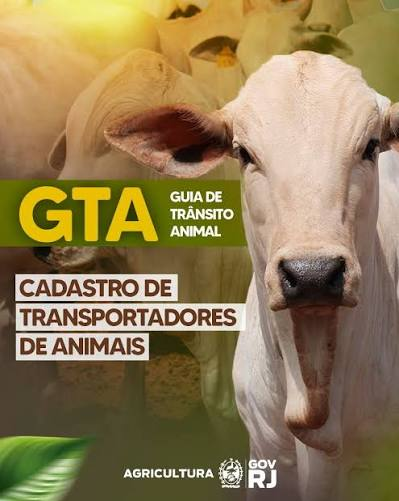
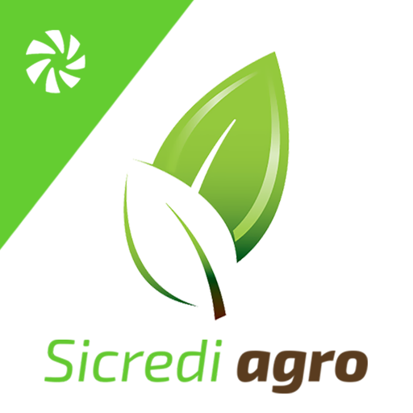

# Entrega 2 — Público-alvo e análise de concorrência

**Data:** {{26/08/2026}}  
**Status:** 🟨 em andamento  
**Responsabilidade mínima:** cada integrante analisa pelo menos 1 concorrente/interface representativa; a equipe produz síntese comparativa.

## Objetivo da atividade

Compreender soluções do mesmo domínio **e também interfaces familiares ao público-alvo**. O objetivo não é copiar telas, mas identificar convenções, padrões, affordances percebidas, problemas recorrentes, expectativas e oportunidades de design.

> **Concorrente não precisa ser idêntico ao produto.** Pode atuar na mesma área, resolver objetivo semelhante ou disputar a mesma necessidade. Quando não houver concorrente direto, use produtos análogos e softwares que o público já utiliza.

### Para TCCs que não previam interface

Não procure apenas um “concorrente do algoritmo”. Investigue **interfaces profissionais que materializam atividades semelhantes** às que o usuário escolhido precisaria realizar.

Exemplos:

- TCC de banco de dados → consoles de administração, ferramentas para DBA, monitoramento e análise de consultas;
- TCC de LLM/ML → painéis de experimentos, gestão de modelos/datasets, comparação de métricas, revisão de resultados;
- TCC de análise de dados → dashboards, ferramentas de BI, filtros, relatórios e exploração;
- TCC de infraestrutura/API → portais administrativos, observabilidade, logs, gestão de credenciais e uso;
- TCC de cibersegurança → consoles de alertas, triagem, histórico e auditoria.

A pergunta é: **“que convenções esse perfil já conhece para executar tarefas equivalentes?”**

## Entrada obrigatória da Entrega 1

Retome o mapa inicial de alternativas e produtos citado na Entrega 1. Aqui a equipe deixa de trabalhar apenas com impressão inicial e passa a **investigar sistematicamente** cada solução.

| Software | Tipo | Por que foi citado | Status inicial | Decisão nesta entrega |
|---|---|---|---|---|
| Cattle Weight AI | concorrente | concorrente direto com funcionalidades semelhantes | F  | analisar C01 |
| Olho do dono | concorrente | funcionalidades diferentes mas voltado para o mesmo público | F  | analisar C02 |
| Olho do dono | concorrente | concorrente direto pois utiliza funcionalidades parecidas (peso por foto do celular)| F  | analisar C03 |

Se uma hipótese da Entrega 1 for confirmada ou refutada durante esta análise, atualize `H01`, `H02`... em [`../RASTREABILIDADE.md`](../RASTREABILIDADE.md).

## 1. Público-alvo desta análise

O público alvo da análise segue sendo o mesmo da entrega 1. Pecuaristas de corte pequeno e médio porte, trabalhadores de campo. Que precisam estimar o peso do gado sem uma balança própria, além de veterinários e técnicos que acompanham o ganho de peso do rebanho.

## 2. Concorrentes diretos/indiretos

### Análise C01 — Cattle Weight AI

**Autor(a):** Gustavo Mendes Franco Lapin Atui — 24.123.072-1  
**Tipo:** direto 
**Link oficial:** https://play.google.com/store/apps/details?id=com.tlt.androidapps.cattlewt&hl=pt_BR  
**Data de acesso:** 26/08/2026

### Análise C02 — Olho do dono

**Autor(a):** Renan Casemiro Hessel — 24.123.019-2  
**Tipo:** direto 
**Link oficial:** https://olhododono.agr.br/ 
**Data de acesso:** 02/09/2026

**Autor(a):** Rafael Takahagi Mendes — 22.126.084-7
**Tipo:** direto
**Link oficial:** https://play.google.com/store/apps/details?id=com.agroninja.beefie
**Data de acesso:** 02/09/2026

#### Contexto e proposta

C01 - O concorrente Cattle Weight AI utiliza visão computacional e inteligência artificial para estimar e acompanhar o ganho de peso do animal (bovíno) através de fotos tiradas pelo celular.

C02 - O concorrente Olho do Dono é uma empresa que desenvolveu um equipamento portátil e com tecnologia própria que permite o produtor a acompanhar e realizar pesagem do rebanho de maneira remota, apenas com uma câmera instalada no curral.

C03 - O concorrente Beefie é um aplicativo da empresa húngara Agroninja que estima o peso do gado a partir de uma única foto lateral do animal, tirada de 2 a 6 metros de distância com um smartphone Android.

#### Funcionalidades relevantes

| Funcionalidade | Como é realizada | Evidência/print | Observação de IHC |
|---|---|---|---|
| C01 | Estimar o peso através de fotos tiradas dentro do aplicativo, acompanhamento de pesagem através de um histórico (por animal) |  | O usuário tira uma foto através do aplicativo, onde a IA estima o peso do animal, salvando o resultado no histórico de pesagem| {{...}} |
| C02 | Pesagem do animal em tempo real, podendo ser vista de forma remota sem estar presente através do aplicativo desenvolvido por eles |   | O animal passa por um corredor no curral aonde a câmera está posicionada, o usuário tem acesso ao peso do animal através do aplicativo, onde é possível ver em tempo real o animal passando e o dispositivo predizendo o peso | {{...}} |
| C03 | Pesagem por foto lateral do animal, em cerca de 40 segundos por cabeça, combinando a imagem com a leitura do medidor a laser pareado via Bluetooth |  | [F] O app depende de um passo extra de setup antes mesmo de chegar na foto (conectar o Bluetooth do laser). Isso adiciona fricção logo no início do fluxo, diferente do nosso caminho pretendido (captura de foto → identificação → peso), que não depende de hardware pareado. |

#### Experiência do usuário e opiniões
C01 - Com base nas avaliações públicas da Play Store (117 avaliações, média **3.0 estrelas**):
- Distribuição polarizada: muitas avaliações de 5 estrelas e muitas de 1 estrela — indica experiência inconsistente.
- Reclamações graves de imprecisão: múltiplos usuários relatam erros superiores a 500 kg ou 500 lbs na predição.
  - *"Off on my calves by over 500 lbs"* — Joshua Vandever, 1 estrela, jun/2026
  - *"Horribly wrong. Off by 500 kgs"* — Liz Du Plessis, 1 estrela, jul/2026
  - *"One dexter cow who does not weigh over 800 lbs was labeled as an Angus at 1,400 lbs"* — Clarence Lupo, 1 estrela, jun/2026
- **Problema crítico:** o desenvolvedor respondeu a múltiplas reclamações de forma agressiva e sarcástica, culpando o usuário em vez de oferecer suporte:
  - Usuário relatou imprecisão → resposta: *"Stop lying, you were using incorrect images"*
  - Usuário relatou que não conseguiu operar o app → resposta: *"just capture the pics and upload. how difficult is it?"*
 
C03 - Com base nas avaliações públicas da Play Store (75 avaliações, média **2.5 estrelas**, ~46 mil instalações):
- Nota média mais baixa que a do C01 (2.5 vs 3.0), o que sugere frustração ainda maior dos usuários.
- O próprio texto de descrição do app já avisa, em letras maiúsculas, que é preciso ter uma licença ativa pra acessar o aplicativo — ou seja, o usuário pode baixar o app de graça e descobrir só depois que não consegue usar nada sem pagar e sem comprar o acessório físico. Isso é uma barreira de entrada exposta de forma pouco amigável.

#### Preço/modelo de negócio

C01 - Gratuito com compras no app, Versão pro disponivel com funcionalidades adicionais.

C03 - [F] Modelo de licença paga obrigatória, vendida junto com o acessório físico (medidor de distância a laser) pelo site da Agroninja — não é possível usar o app sem comprar o pacote completo. Existe uma licença "plus" que adiciona a medição de altura do animal. Diferente do C01 (freemium, uso imediato) e mais parecido com o C02 em exigir hardware, mas em escala bem menor (um acessório portátil, não uma câmera 3D fixa).

#### Padrões e tendências percebidos

C01:   
  - Dois botões de entrada claros (Camera e Library) na tela inicial.
  - Orientação de captura antes da foto — reduz erros sem treinamento do usuário.
  - Peso em kg em tipografia grande como elemento principal do resultado.
  - Intervalo de confiança exibido junto ao resultado.
  - Dados complementares do animal (raça, sexo, medidas).

C03:
- [F] Fluxo pensado pra ser feito "dentro da caminhonete" — foto a distância, sem precisar entrar no curral com o animal.
- [F] Adaptação de mercado visível: a versão original só cobria algumas raças europeias e animais adultos; a equipe teve que desenvolver uma versão nova pra cobrir Nelore (mais de 80% do rebanho brasileiro) e bezerros. [H] Isso é um sinal forte de que modelos treinados fora do Brasil (como o nosso, treinado em gado de Bangladesh) tendem a errar mais em Nelore até passarem por esse tipo de ajuste — reforça um risco que já era hipótese no TCC.
- [F] Integração com um "HUB" de gestão do rebanho da própria empresa, indo além do peso isolado (estoque, tendências em gráfico).

#### Pontos positivos, limitações e lições - C03

| Ponto | Evidência | Implicação para nosso projeto |
|---|---|---|
| Fluxo rápido (~40s por animal), foto a distância, sem precisar manusear o animal | Descrição do produto em matérias especializadas | [H] Reforça que "rapidez por cabeça" é um valor percebido nesse mercado — vale considerar isso ao definir a meta de tempo da nossa tela de captura |
| Exige hardware pareado + licença paga antes mesmo do primeiro uso | Descrição do app na Play Store, avaliação 2.5 estrelas | [F] Confirma, junto com o C02, que depender de acessório externo é um padrão de mercado, mas também parece ser fonte de frustração/nota baixa — reforça a decisão de manter nosso app funcionando só com o celular, sem hardware adicional |
| Precisou de retrabalho específico pra funcionar com Nelore | Matérias sobre a expansão do Beefie pro Brasil | [H] Vira argumento concreto pra registrarmos como hipótese de risco do próprio TCC (modelo treinado fora do Brasil pode precisar de ajuste pra Nelore) |

> Repita a subseção para C02, C03... até atender à quantidade da equipe.

## 3. Softwares que o público-alvo usa no cotidiano

Analise interfaces que moldam a expectativa do público, mesmo que não sejam concorrentes.

| Software | Por que o público usa | Padrões relevantes | Prints | O que aprender |
|---|---|---|---|---|
| WhatsApp | [F] Já registrado no repositório como referência de "estilo de navegação simples" pro público — app de comunicação mais usado no meio rural, inclusive pra falar com técnico, comprador e frigorífico | Lista de conversas, envio rápido de foto, ícones grandes, pouco texto |  | Confirma a decisão já tomada de manter navegação estilo WhatsApp: poucas telas, ações grandes e diretas, mínimo de texto pra ler |
| App/portal da GTA (Guia de Trânsito Animal) | [F] Documento sanitário obrigatório por lei (IN MAPA) pra qualquer transporte de gado — a maioria dos estados já oferece emissão pelo celular via app ou portal da secretaria de agricultura | Fluxo burocrático guiado passo a passo, upload de documento/foto, confirmação de dados oficiais (CPF, propriedade) | | É a referência mais próxima do "app oficial agro" que o pecuarista já usa — mostra que ele tolera processos formais no celular quando é obrigatório, mas também expõe o risco: são interfaces normalmente burocráticas e nada amigáveis, então reforça que a NOSSA interface precisa ser mais simples que a média do setor, não repetir esse padrão |
| App do Sicredi (Sicredi Agro / app principal) | [F] Sicredi é a maior cooperativa de crédito rural do Brasil, com linha específica de crédito pecuário (custeio, investimento em animais, CPR Fácil) e um app próprio pra acompanhar proposta de financiamento e usar Pix/conta corrente direto do celular | Acompanhamento de status de proposta em etapas ("em análise", "aprovado"), anexar foto/documento direto pelo app, notificação de progresso, Pix com fluxo curto |  | É o exemplo mais forte de "app financeiro que o pecuarista já confia e usa com frequência" — reforça a ideia de mostrar status/progresso de forma clara (ex.: "processando foto", "peso calculado") e de aceitar foto/documento anexado direto pela câmera, sem etapas extras |

## 3.1 Padrões de interface relevantes ao escopo de IHC

Registre somente padrões encontrados nas soluções analisadas e que possam ter relação com objetivos reais da equipe.

| Padrão observado | Produto(s) | Para qual tarefa serve | Vantagem percebida | Risco/limitação | Aplicável ao nosso escopo? |
|---|---|---|---|---|---|
| dashboard | nenhum concorrente analisado (C01, C02, C03) tem um dashboard robusto — o mais próximo é o relatório pós-processamento do C02/C03 | consultar visão geral do rebanho | organizaria dados de várias pesagens em um só lugar pro pecuarista/técnico | pode ser pesado demais pro perfil do usuário e pra conexão instável do contexto de uso (curral/pasto) | talvez |
| relatório | C02 (relatório de peso individual, GMD, contagem de cabeças, auditoria) e C03 (relatório com GMD e integração ao HUB de estoque) | acompanhar evolução do peso do rebanho ao longo do tempo | dá visão gerencial útil pro técnico agropecuário, não só pro pecuarista | os dois concorrentes só entregam isso depois de processamento em nuvem, não na hora — foge do nosso fluxo pretendido de "foto → resultado imediato" | talvez |
| histórico + filtros | nenhum concorrente direto detalha isso claramente na análise; App do Sicredi mostra padrão parecido de "acompanhar status/progresso" que pode inspirar histórico | consultar peso de um animal específico ao longo do tempo (A03) | facilita achar rápido o dado de um animal entre vários, sem precisar rolar tudo | se mal projetado, pode ficar complexo demais pro perfil do usuário (pouca prática digital) | sim |
| administração/CRUD | GTA (cadastro de dados oficiais do produtor/propriedade) e app do Sicredi (cadastro/anexo de documentos) mostram esse padrão em apps agro que o público já usa | cadastrar/editar dados do fazendeiro e do rebanho | necessário pra manter o histórico de pesagem vinculado ao animal e à propriedade certos | pode virar tela pesada e burocrática se copiar o estilo dos apps oficiais (GTA), que são conhecidos por serem pouco amigáveis | talvez |
| comparação de resultados | nenhum concorrente analisado (C01, C02, C03) oferece isso de forma explícita | comparar peso estimado entre fotos/tentativas diferentes do mesmo animal | ajudaria a validar se a estimativa está consistente antes de salvar no histórico | não é prioridade nas atividades A01-A03 já definidas pela equipe | não |

> O objetivo não é concluir “todo concorrente tem dashboard, então teremos um”. O padrão só será adotado se apoiar uma tarefa rastreável.

## 4. Síntese comparativa da equipe

| Critério | C01 (Cattle Weight AI) | C02 (Olho do Dono) | C03 (Beefie) | Oportunidade para o projeto |
|---|---|---|---|---|
| Navegação | Simples, poucos passos (foto → resultado → histórico) | App é secundário ao hardware; navegação voltada a consulta de relatório, não a captura | Fluxo curto de captura (~40s), mas com passo extra de pareamento Bluetooth antes | Manter navegação enxuta tipo C01, mas sem exigir setup de hardware como C03 |
| Feedback/estado | Mostra resultado com intervalo de confiança | Feedback só chega depois do processamento em nuvem (não instantâneo) | Não fica claro feedback de incerteza — só o peso final | Dar feedback rápido, claro e com indicação de confiabilidade na hora da foto |
| Prevenção/recuperação de erro | Fraca — quando o resultado está errado, o app (e o suporte) não ajuda o usuário a entender ou corrigir | Reduz erro de identificação via RFID (hardware), não via app | Depende do usuário conectar o laser corretamente; sem esse passo, não há como usar o app | Precisamos resolver identificação do animal (A02) só na interface, com validação clara antes de salvar o histórico |
| Terminologia | Em inglês, técnica (não adaptada ao pecuarista brasileiro) | Institucional/técnica, focada em métricas de gestão (GMD, auditoria) | Institucional/técnica (GMD, "withers height"), pouco adaptada ao pecuarista comum | Usar vocabulário do próprio produtor: arroba, brinco, lote — já decidido no repositório |
| Acessibilidade | Sem adaptação aparente pra uso com sol forte/mãos sujas | Não se aplica da mesma forma (equipamento fixo, não celular do usuário) | Exige manusear um acessório físico junto com o celular — mais difícil com mãos sujas/sol forte | Pensar em contraste alto, botões grandes, mínimo de digitação — nosso contexto de uso é mais hostil que o dos três concorrentes |
| Eficiência | Rápido, mas resultado pouco confiável | Muito eficiente em escala (lote inteiro), mas lento pra resultado individual imediato | Rápido por animal (~40s), mas com custo de setup e aquisição de licença/hardware | Buscar o meio-termo: rápido como C01/C03, mas sem exigir hardware extra e com confiabilidade comunicada de forma honesta |

## 5. Recomendações derivadas

Liste recomendações com origem explícita.

- **RC01:** Mostrar o peso estimado com tipografia grande como elemento central da tela de resultado — derivada de C01 (padrão de UI) e do contexto de uso (sol forte, pressa).
- **RC02:** Exibir algum indicador de confiabilidade/margem de erro junto ao resultado, e não só o número seco — derivada de C01 (o app tem intervalo de confiança, mas mesmo assim a experiência falhou porque não havia suporte quando o erro era grande). No nosso caso isso é ainda mais importante porque nosso MAE real (~20,75 kg) é conhecido e deveria ser comunicado com honestidade, não escondido.
- **RC03:** Ter um caminho claro de "o que fazer quando o resultado parece errado" (ex.: opção de nova foto, ou registrar como incerto) — derivada da falha de suporte do C01 nas avaliações da Play Store.
- **RC04:** Resolver a identificação do animal (A02) inteiramente por interface (sem depender de hardware extra tipo RFID ou laser pareado) — derivada da comparação C02 (RFID) e C03 (laser Bluetooth) vs. nosso escopo, que não tem leitor de brinco nem acessório dedicado.
- **RC05:** Projetar telas e feedbacks que funcionem com conexão instável (ex.: indicar "salvo localmente, enviando quando conectar") — derivada da observação dos apps bancários citados na seção 3 e do contexto de uso já registrado no repositório (conexão instável no curral/pasto).
- **RC06:** Não exigir nenhum passo de setup de hardware/licença antes do primeiro uso — derivada de C03, cuja nota baixa (2.5★) parece estar associada à barreira de precisar comprar licença + acessório físico antes de conseguir usar o app.
- **RC07:** Se possível, adaptar/validar o modelo especificamente para Nelore antes de lançar — derivada de C03, que precisou desenvolver uma versão específica pra Nelore depois de lançar focado em raças europeias; nosso modelo também foi treinado fora do Brasil (Bangladesh) e ainda não foi validado com Nelore.

## Referências

- Beefie (Agroninja) — página no APKCombo (espelho, já que o link direto da Play Store não abriu de forma consistente): https://apkcombo.com/agroninja-beefie-stressless/com.agroninja.beefie/ (acesso 02/09/2026)
- Beefie (Agroninja) — página no Softonic (espelho, nota 2.5★, 75 avaliações): https://agroninja-beefie.en.softonic.com/android
- Agroninja — site oficial: https://agroninja.com/#/introduction
- CompreRural — "Aplicativo permite pesar o gado pelo celular e com apenas uma foto": https://www.comprerural.com/aplicativo-permite-pesar-o-gado-pelo-celular-e-com-apenas-uma-foto-video/
- Portal Agrienergy — "Aplicativo permite pesar o gado pelo celular e com apenas uma foto" (adaptação pra Nelore): https://agrienergy.com.br/2024/07/09/aplicativo-permite-pesar-o-gado-pelo-celular-e-com-apenas-uma-foto/
- Ministério da Agricultura e Pecuária — Guia de Trânsito Animal (GTA): https://www.gov.br/agricultura/pt-br/assuntos/sanidade-animal-e-vegetal/saude-animal/cgtqa/t_nacional/gta
- Sicredi — Crédito para o agronegócio (CPR, custeio, app Sicredi Agro): https://www.sicredi.com.br/site/credito/para-agronegocio/

## Checklist

- [ ] O mapa inicial de alternativas da Entrega 1 foi revisitado e aprofundado.
- [ ] Hipóteses relevantes sobre mercado/padrões foram atualizadas na rastreabilidade quando surgiram evidências.
- [ ] Há pelo menos uma análise completa por integrante.
- [ ] Cada análise contém prints legíveis da interface.
- [ ] Prints mostram telas/estados relevantes, não apenas logos/homepage.
- [ ] Foram analisados concorrentes e/ou interfaces representativas ao público.
- [ ] Em TCC sem interface original, foram investigadas ferramentas profissionais análogas às atividades do usuário escolhido.
- [ ] Padrões como dashboard, relatório, filtros e CRUD foram analisados como soluções para tarefas, não como requisitos automáticos.
- [ ] Opiniões de UX têm fonte.
- [ ] A síntese compara critérios comuns e produz recomendações.
- [ ] Não há “copiar porque o concorrente faz”; há justificativa de adequação ao público/contexto.
